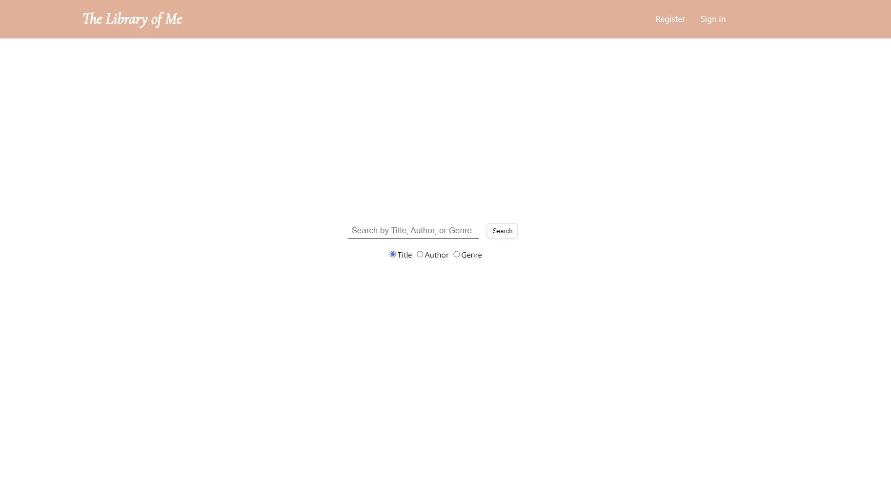
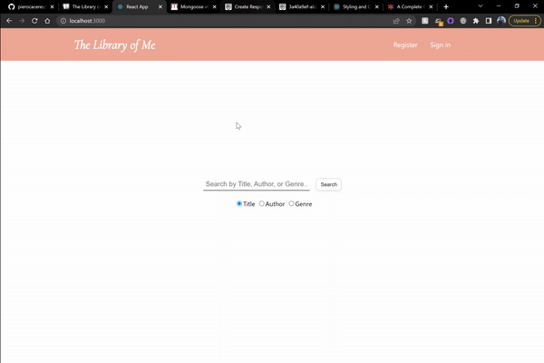
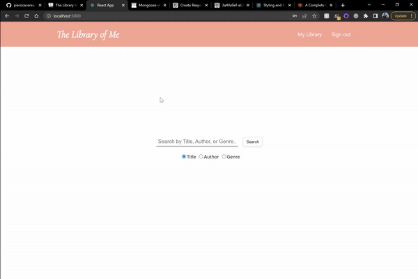
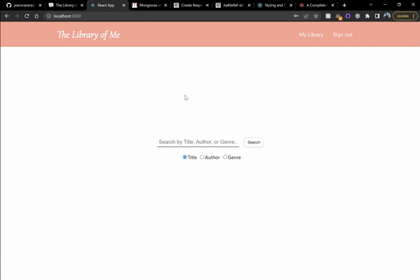
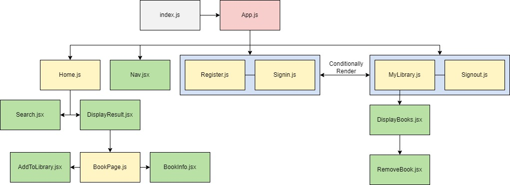
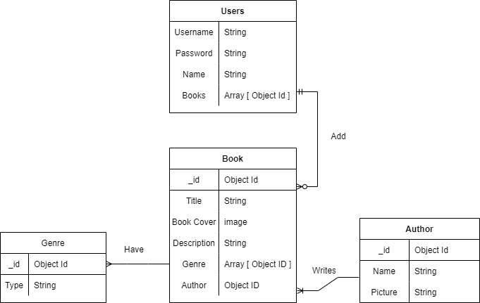

# The Library Of Me

###### Created by Piero Caceres | [LinkedIn](https://www.linkedin.com/in/pcace/)

## Description

This is a website for readers to keep track of books they currently own or have on their shelves. Users will be able to add books by search for a book by title, author, or genres. React was use to create the front end of the website and MongoDB was used to create the database. These two components speak to each other via axios.

## Getting Started

Start keeping track of your library by [clicking here](https://cherry-pudding-94660.herokuapp.com/).

The progress of this project will be monitored using [Trello.](https://trello.com/b/WrVjH1Kw/the-library-of-me)

## Features

### Search

You can search the database for books via book title, authors, or genre.

### Book Information

Each book has a short description with its genre and author. If the book peaks your interest or you already own it, add it to your library.

### My Library

On this page you will find your books displayed that are currently in your library. Want to donate your book? Do you want to give it to a friend? Did you just lose it somehow? No worries. If you no longer own the book, you can go ahead and remove it from your library.

## Frontend

## Backend

## Future Updates

- [ ] Incorporate a more dynamic search functionality
- [ ] Make it friendly with various screens
- [ ] Use a 3rd party api to call a range of books

## Credit

[CSS Styling for Buttons: Button 13, 45](https://getcssscan.com/css-buttons-examples)

Classmates
* Alex Barbosa - Provide JavaScript guard operator assistance
* Tim Ellis - Provide JavaScript suggestions/idea
* David Wu - Provided help with the Backend
* Yusong Shi - Provided help CSS Styling
* Trevor Bond / Tylus Dawkins - Moral Support
