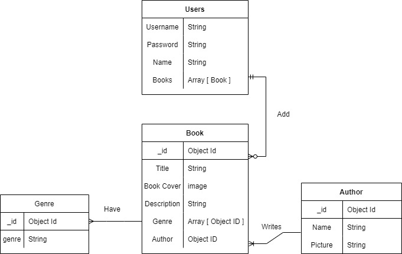

# The Library Of Me
###### Created by: Piero Caceres

## Description

This is an application for readers to keep track of books they currently own or have on their shelves. You are able to search for books by title, author, or genres.

## Frontend

## Backend

## Development Progress
The progress of this project will be monitored using [Trello.](https://trello.com/b/WrVjH1Kw/the-library-of-me)

## Cresid

[CSS Styling for Buttons: Button 13, 45](https://getcssscan.com/css-buttons-examples)